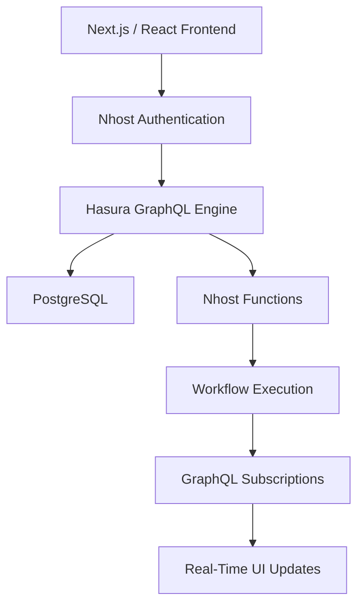

# AI Agent Workflow Builder

A full-stack **AI Agent Workflow Builder** built using **Next.js, React, TypeScript, Nhost, Hasura, PostgreSQL, GraphQL, Docker, and Nhost Functions**.

The application enables organizations to create, execute, and monitor multi-step AI workflows with **role-based access control (RBAC), approval gates, quota management, and real-time execution updates**.

---

# Live Demo

🔗 https://workflow-builder-black-tau.vercel.app

---

# Features

- Organization-based authentication
- Role-Based Access Control (Owner, Editor, Viewer)
- Multi-step AI workflow execution
- LLM-powered workflow steps
- HTTP API integration
- Conditional branching
- Human approval gates
- Database write operations
- Notification steps
- Workflow quota management
- Real-time workflow monitoring using GraphQL Subscriptions
- Secure organization-level data isolation

---

# Tech Stack

## Frontend

- Next.js 16
- React 19
- TypeScript
- Nhost SDK
- GraphQL
- GraphQL WebSocket

## Backend

- Nhost
- Hasura GraphQL Engine
- PostgreSQL
- Nhost Functions
- Hasura Actions

## Infrastructure

- Docker
- Nhost CLI
- GitHub

---

# System Architecture



---

# Database Schema

```
organizations
│
├── org_members
│
├── workflows
│
├── workflow_steps
│
├── workflow_triggers
│
├── workflow_runs
│
└── step_runs
```

## Tables

### organizations

Stores organization details.

### org_members

Stores organization members and their assigned roles.

### workflows

Stores workflow definitions.

### workflow_steps

Stores each step belonging to a workflow.

### workflow_triggers

Stores workflow trigger configuration.

### workflow_runs

Stores execution history.

Supported states:

- Running
- Paused
- Completed
- Failed

### step_runs

Stores execution details for every workflow step including:

- Status
- Input
- Output
- Error message
- Attempt count
- Approval metadata

---

# Supported Workflow Steps

| Step | Description |
|-------|-------------|
| LLM Call | Executes an AI/LLM request |
| HTTP Request | Calls an external REST API |
| Conditional Branch | Executes conditional logic |
| Approval Gate | Waits for authorized user approval |
| Database Write | Stores workflow data |
| Notify | Sends notifications |

---

# Authorization

The application uses **Role-Based Access Control (RBAC)**.

## Owner

- Full organization management
- Manage users
- Create/Edit/Delete workflows
- Execute workflows
- Approve workflow steps

## Editor

- Create workflows
- Edit workflows
- Execute workflows

Cannot:

- Manage organization members

## Viewer

- View workflows
- Monitor executions

Cannot:

- Execute workflows
- Approve workflows
- Modify workflows

---

# Organization Isolation

All workflow data is scoped to the authenticated user's organization.

Users from one organization **cannot access** workflows belonging to another organization even if they know the workflow ID.

---

# Workflow Execution

```text
User
    │
    ▼
Next.js Frontend
    │
    ▼
Hasura Action
    │
    ▼
Authentication
    │
    ▼
Organization Validation
    │
    ▼
Role Validation
    │
    ▼
Quota Check
    │
    ▼
Create workflow_run
    │
    ▼
Execute Workflow
    │
    ▼
LLM Call
    │
    ▼
HTTP Request
    │
    ▼
Conditional Branch
    │
    ▼
Approval Gate
    │
    ▼
Workflow Completed
```

The `triggerWorkflowRun` function validates:

- Authenticated user
- Organization membership
- User role
- Available quota

before creating a workflow execution.

The `approveStep` function validates the approver before resuming paused workflows.

---

# Approval Gate

When execution reaches an approval step:

```
Running
        ↓
Paused
        ↓
Awaiting Approval
        ↓
Approved
        ↓
Workflow Continues
```

Only authorized users can approve paused workflow steps.

---

# Real-Time Updates

Workflow execution status is streamed using **GraphQL Subscriptions**.

```
Workflow Function
        │
        ▼
PostgreSQL
        │
        ▼
Hasura
        │
        ▼
GraphQL Subscription
        │
        ▼
Next.js Frontend
        │
        ▼
Live Workflow Status
```

The frontend receives workflow updates instantly without refreshing the page.

---

# Tested End-to-End Workflow

The tested workflow contains:

1. LLM Call
2. HTTP Request
3. Conditional Branch
4. Approval Gate

Execution Flow

```
Login
    ↓
Run Workflow
    ↓
LLM Call
    ↓
HTTP Request
    ↓
Conditional Branch
    ↓
Approval Gate
    ↓
Paused
    ↓
Approval
    ↓
Workflow Completed
```

Verified successfully:

- Workflow Run creation
- Quota updates
- Approval pause/resume
- Live GraphQL subscription events
- Successful workflow completion

---

# Local Setup

## Prerequisites

- Node.js
- npm
- Docker Desktop
- WSL (Windows)
- Nhost CLI
- Git

---

## Clone Repository

```bash
git clone https://github.com/Dishaks123/workflow-builder.git

cd workflow-builder
```

---

## Start Nhost

```bash
nhost up
```

Verify services:

```bash
docker ps
```

---

## Start Frontend

```bash
cd frontend

npm install

npm run dev
```

Open:

```
http://localhost:3000
```

---

## Production Build

```bash
npm run build
```

---

# Project Structure

```text
workflow-builder/
│
├── frontend/
│   └── app/
│
├── functions/
│   ├── triggerWorkflowRun.ts
│   └── approveStep.ts
│
├── nhost/
│   ├── metadata/
│   └── migrations/
│
├── .gitignore
│
└── README.md
```

---

# Security

Sensitive files are excluded from Git using `.gitignore`.

Ignored files include:

- .env
- .nhost
- .secrets
- node_modules
- .next

No secrets or generated files are committed to the repository.

---

# Future Enhancements

- Drag-and-drop workflow editor
- Workflow templates
- AI model selection
- Retry failed workflow steps
- Scheduled workflow execution
- Email and Slack notifications
- Workflow versioning
- Execution analytics dashboard

---

# Repository

**GitHub**

https://github.com/Dishaks123/workflow-builder

---

# Project Goal

This project demonstrates a production-style AI workflow platform implementing:

- Full-stack application development
- Authentication and Authorization
- Organization-based access control
- Workflow orchestration
- Human approval workflows
- GraphQL subscriptions
- PostgreSQL database design
- Real-time execution monitoring
- Secure backend validation using Nhost Functions
